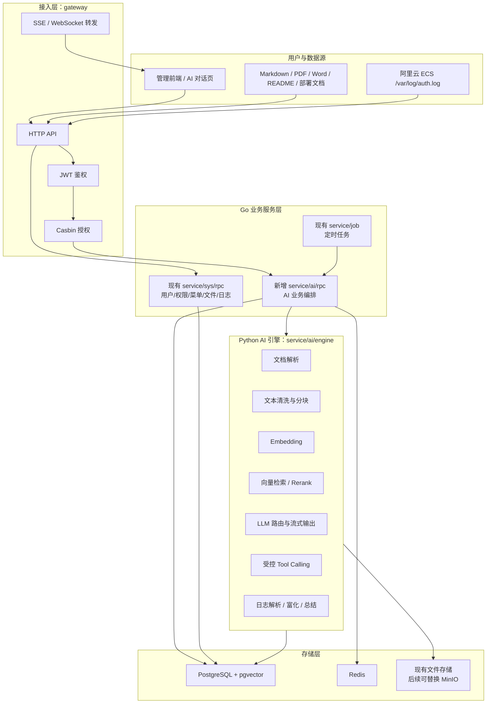
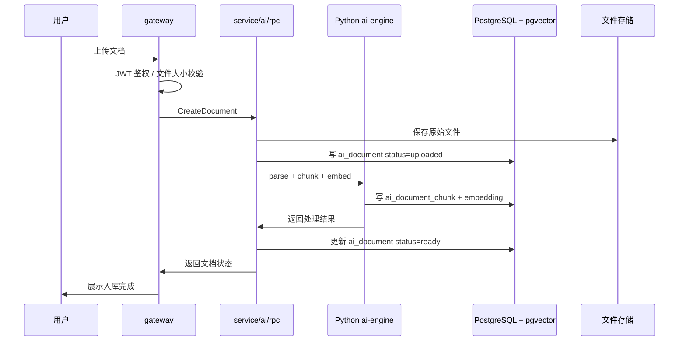
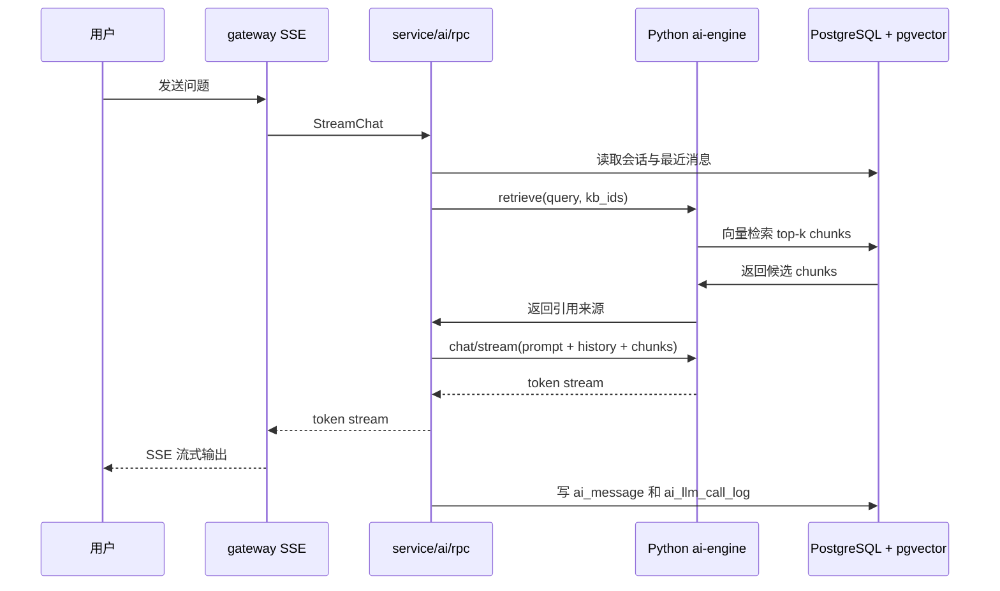
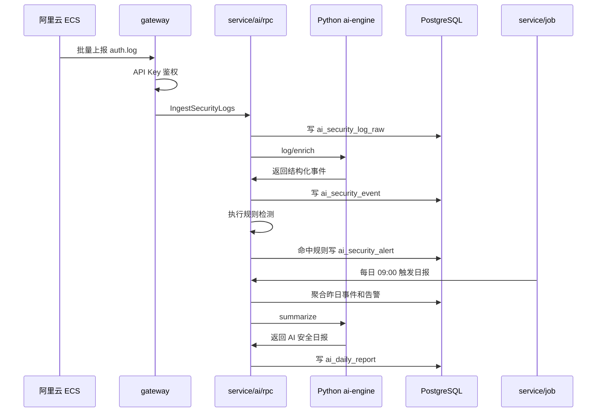

# AI 运维与知识管理平台方案设计

> 本文档根据 `docx/ai优化.md` 的需求整理，目标是把当前通用系统管理微服务升级为一个能展示 AI 应用开发能力的项目作品。方案重点回答：项目应用价值是什么、MVP 做什么、Go 与 Python 怎么分工、架构和数据流怎么设计、数据库初稿如何落地。

## 1. 项目定位与应用价值

当前项目是一个 Go + go-zero 的通用系统管理微服务，已有用户、角色、菜单、接口、文件、登录日志、操作日志、定时任务等基础能力。直接围绕现有登录日志做 AI 分析，价值不够强，因为系统使用量低，日志数据主要来自自己本地操作，缺少真实业务场景。

更合适的定位是：

**AI 运维与知识管理平台**

它不是简单给后台管理系统套一层 AI 对话，而是把现有系统作为统一管理底座，扩展出两类真实可演示、可解释、可面试讲清楚的 AI 应用：

1. **个人技术知识库 RAG**：把 Markdown、PDF、Word、接口文档、部署文档、故障手册等资料沉淀成可检索、可追溯来源的 AI 问答能力。
2. **云服务器登录安全智能分析**：采集个人阿里云 ECS 的 SSH 登录日志，识别暴力破解、异常 IP、异常地区、登录失败趋势，并生成 AI 安全日报。

这两个方向的应用价值互补：

| 方向 | 解决的问题 | AI 价值 | 面试表达 |
| --- | --- | --- | --- |
| 知识库 RAG | 文档分散、排查问题靠记忆、知识难复用 | 文档解析、向量检索、引用溯源、多轮问答 | 完整 RAG 工程链路 |
| 登录安全分析 | 云服务器每天有大量恶意登录尝试，裸日志难读 | 日志富化、异常识别、LLM 总结、对话式查询 | AI + 运维安全场景 |

最终项目可以讲成：

> 我基于原有 go-zero 微服务后台，扩展了一个 AI 应用平台。Go 层负责网关、鉴权、权限、业务编排和日志治理；Python AI 引擎负责文档解析、Embedding、RAG 检索、LLM 调用和受控 Agent。MVP 支持知识库问答和云服务器登录安全分析，后续可以平滑扩展 Kafka、Flink、ES、Doris、独立向量库和 LLMOps。

## 2. 为什么选择 RAG + 登录安全分析作为 MVP

### 2.1 不建议只做当前系统登录日志

当前后台系统用户少，登录日志和操作日志主要来自开发测试。围绕这部分做 AI 分析，容易变成“为了 AI 而 AI”，数据量、业务痛点和可展示价值都不足。

### 2.2 不建议一开始接公司服务器日志

公司内部日志可能包含敏感信息，个人项目采集存在合规风险。即使技术上可行，也不适合作为个人跳槽作品的 MVP 数据来源。

### 2.3 推荐 MVP 组合

**MVP = 个人知识库 RAG + 个人阿里云 ECS 登录安全分析**

选择理由：

1. 数据可得：个人文档和个人云服务器日志都可控。
2. 场景真实：服务器每天大量失败登录本身就是明确痛点。
3. 技术覆盖完整：RAG、Embedding、向量库、流式对话、日志解析、异常检测、LLM 总结都能覆盖。
4. 可渐进扩展：MVP 不需要 Kafka/Flink，后续可以替换后台 worker 为实时流处理链路。
5. 面试表达清楚：既有 AI 应用能力，又能体现 Go 微服务工程能力。

## 3. Go 与 Python 技术选型结论

结论：**Go + Python 混合架构**。

| 层次 | 推荐语言 | 职责 |
| --- | --- | --- |
| 接入层 | Go | HTTP 网关、JWT、Casbin、限流、SSE/WS 转发 |
| 业务编排层 | Go | 会话、知识库、日志事件、告警、任务状态、数据库事务 |
| AI 引擎层 | Python | 文档解析、分块、Embedding、向量检索、Rerank、LLM、Agent |
| 存储层 | PostgreSQL + pgvector | 业务数据、向量数据、对话记录、日志分析结果 |

### 3.1 为什么不是纯 Go

Go 适合写高并发服务和微服务治理，但 AI 应用开发生态相对 Python 弱。文档解析、RAG 框架、Embedding、Reranker、模型 SDK、实验工具和 LLMOps 集成，大多优先支持 Python。用纯 Go 做 AI 引擎会把大量时间耗在 SDK 封装和解析工具补齐上，不利于快速形成作品。

### 3.2 为什么不是纯 Python

当前项目已经是 go-zero 微服务体系，已有网关、鉴权、权限、用户、日志、任务调度等基础能力。全部推翻改成 Python 没必要，也会丢掉 Go 微服务项目的工程优势。

### 3.3 最佳分工

Go 负责“系统工程能力”，Python 负责“AI 应用能力”：

- Go 保留现有项目优势：网关、RPC、RBAC、审计日志、定时任务、数据库模型。
- Python 负责变化快的 AI 能力：LlamaIndex/LangChain、文档解析、Embedding、LLM provider 接入、Agent 工具调用。
- Go 与 Python 通过 HTTP JSON + SSE 通信，降低跨语言流式调用复杂度。

## 4. 总体分层架构图



### 4.1 与当前仓库的映射

```text
go-zero-rpc/
├── gateway/                  # 现有网关，新增 /api/ai/* 路由
├── service/
│   ├── sys/rpc/              # 现有系统服务，不改核心逻辑
│   ├── job/                  # 现有定时任务，新增 AI 日报任务
│   └── ai/                   # 新增
│       ├── rpc/              # Go AI 编排服务
│       └── engine/           # Python FastAPI AI 引擎
├── common/                   # 现有公共包
├── deploy/
│   └── ai.sql                # 新增 AI 表结构
└── docx/
    └── ai优化_方案设计.md
```

## 5. 核心功能模块拆分

### 5.1 知识库管理

用途：沉淀个人或项目文档，让 AI 基于可信资料回答问题。

核心能力：

- 创建、编辑、删除知识库。
- 上传 Markdown、TXT、PDF、Word、HTML、README、接口文档、部署文档、故障处理手册。
- 记录文档状态：`uploaded`、`parsing`、`chunking`、`embedding`、`ready`、`failed`。
- 支持失败重试。
- 支持按知识库隔离检索范围。

MVP 边界：

- 先做个人私有知识库，不做团队权限。
- 文件存储先复用当前系统文件能力，后续再替换 MinIO。
- 文档类型先支持 Markdown、TXT、PDF、Word，HTML 可二期做。

### 5.2 文档解析与向量化

用途：把原始文件转成可检索的 chunk。

流程：

1. Go 网关接收上传文件。
2. Go `ai-rpc` 写入 `ai_document`，状态为 `uploaded`。
3. Python AI 引擎解析文档文本。
4. 对文本做清洗、分块、token 估算。
5. 调用 Embedding 模型生成向量。
6. 写入 `ai_document_chunk`。
7. 更新文档状态为 `ready`。

默认策略：

- Embedding 模型：`bge-m3`。
- 向量维度：1024。
- 分块策略：800 token 左右，100 token overlap。
- 向量索引：pgvector HNSW + cosine。

### 5.3 RAG 对话助手

用途：让用户用自然语言查询知识库，并返回带来源的答案。

核心能力：

- 多轮会话。
- 支持选择一个或多个知识库。
- 问题向量化后做 top-k 检索。
- 可选 rerank，MVP 可先预留接口。
- 回答通过 SSE 流式返回。
- 回答附带引用来源，如文档名、页码、chunk 位置。
- 持久化用户消息、助手消息、引用、token 数、耗时。

### 5.4 登录安全日志接入

用途：采集个人阿里云 ECS 登录日志，识别恶意登录和异常行为。

数据来源：

- `/var/log/auth.log` 或系统对应的 SSH 登录日志。
- MVP 推荐 Filebeat 或轻量脚本按批次 POST 到网关。

接入入口：

- `POST /api/ai/security/logs/ingest`
- 鉴权方式使用专用 API Key，不使用普通用户 JWT。

采集字段：

- `source`：日志来源，例如 `aliyun-ecs-1`。
- `raw_line`：原始日志行。
- `occurred_at`：日志发生时间。
- `host_name`：主机名。
- `log_type`：如 `ssh`。

### 5.5 日志富化与异常检测

用途：把难读的原始日志转成可分析事件。

富化字段：

- 事件类型：`login_failed`、`login_success`、`invalid_user`、`sudo`。
- 用户名。
- 来源 IP。
- 国家、城市、ASN、运营商。
- 登录方式：password、publickey。
- 客户端工具或 SSH 版本。
- 威胁分数。

MVP 异常规则：

| 规则 | 条件 | 告警类型 | 严重级别 |
| --- | --- | --- | --- |
| 暴力破解 | 5 分钟同 IP 失败登录 >= 10 次 | `brute_force` | high |
| 高危 IP | 威胁分数 >= 80 且有登录尝试 | `malicious_ip` | high |
| 罕见地区成功登录 | 成功登录来自非常用国家或城市 | `unusual_location` | critical |
| 用户名爆破 | 10 分钟内同 IP 尝试用户名 >= 5 个 | `username_spray` | medium |

MVP 可以先使用规则引擎，不急于引入机器学习异常检测。规则简单、可解释、容易演示。

### 5.6 AI 安全日报

用途：把过去一天的日志和告警转成可读报告。

日报内容：

- 失败登录总数。
- 成功登录次数。
- 告警数量。
- Top IP、Top 国家、Top 用户名。
- 高危 IP 列表。
- 攻击时间段分布。
- AI 总结和处置建议。

触发方式：

- `service/job` 每天 09:00 调用 `ai-rpc`。
- `ai-rpc` 聚合数据后调用 Python `/v1/summarize`。
- 结果写入 `ai_daily_report`。

### 5.7 LLMOps 记录模块

用途：记录每一次 LLM 调用，方便调试、成本估算、错误追踪和后续接 Langfuse。

记录内容：

- 调用场景：chat、summary、agent。
- provider 和 model。
- prompt、completion。
- token 数。
- latency。
- status 和 error message。
- trace id。

MVP 先自建 `ai_llm_call_log`，二期再双写 Langfuse。

### 5.8 AI 配置中心

用途：统一管理模型供应商和模型参数。

MVP 先做数据库配置和后台读取，不一定做完整前端页面。

配置内容：

- provider：OpenAI、DeepSeek、智谱、本地模型等。
- model name。
- model type：chat、embedding、rerank。
- API base。
- API key 引用名。
- 是否启用。
- 是否默认。

## 6. 公共接口规划

### 6.1 Gateway 对外接口

```text
知识库
POST   /api/ai/kb
GET    /api/ai/kb
GET    /api/ai/kb/:id
PUT    /api/ai/kb/:id
DELETE /api/ai/kb/:id

文档
POST   /api/ai/document/upload
GET    /api/ai/document
GET    /api/ai/document/:id
POST   /api/ai/document/:id/retry
DELETE /api/ai/document/:id

对话
POST   /api/ai/chat/conversation
GET    /api/ai/chat/conversation
GET    /api/ai/chat/conversation/:id/messages
POST   /api/ai/chat/stream
DELETE /api/ai/chat/conversation/:id

登录安全
POST   /api/ai/security/logs/ingest
GET    /api/ai/security/events
GET    /api/ai/security/alerts
PUT    /api/ai/security/alerts/:id/status
GET    /api/ai/security/reports/daily
POST   /api/ai/security/reports/daily/generate

配置与观测
GET    /api/ai/models
POST   /api/ai/models
PUT    /api/ai/models/:id
GET    /api/ai/llm-calls
```

### 6.2 Python AI 引擎内部接口

这些接口只给 Go `ai-rpc` 调用，不直接暴露公网。

```text
POST /v1/parse
POST /v1/chunk
POST /v1/embed
POST /v1/retrieve
POST /v1/rerank
POST /v1/chat
POST /v1/chat/stream
POST /v1/log/enrich
POST /v1/summarize
POST /v1/agent/run
```

### 6.3 受控 Agent 工具规划

MVP 不做无限制自主 Agent，只做受控 Tool Calling。可用工具由后端白名单注册。

```text
query_knowledge_base(query, kb_ids, top_k)
query_security_events(start_time, end_time, src_ip, event_type)
query_security_alerts(start_time, end_time, severity, status)
generate_security_report(date)
get_alert_detail(alert_id)
```

Agent 必须满足：

- 工具参数使用结构化 schema。
- 不允许执行任意 shell 命令。
- 不允许直接访问数据库连接信息。
- 工具返回结构化 JSON，再由 LLM 组织自然语言答案。

## 7. 数据库设计初稿

前置扩展：

```sql
CREATE EXTENSION IF NOT EXISTS vector;
```

### 7.1 知识库与文档

```sql
CREATE TABLE ai_knowledge_base (
  id BIGSERIAL PRIMARY KEY,
  user_id BIGINT NOT NULL,
  name VARCHAR(128) NOT NULL,
  description VARCHAR(512) NOT NULL DEFAULT '',
  visibility VARCHAR(16) NOT NULL DEFAULT 'private',
  embed_model VARCHAR(64) NOT NULL DEFAULT 'bge-m3',
  doc_count INTEGER NOT NULL DEFAULT 0,
  chunk_count INTEGER NOT NULL DEFAULT 0,
  created_at TIMESTAMP NOT NULL DEFAULT CURRENT_TIMESTAMP,
  updated_at TIMESTAMP NOT NULL DEFAULT CURRENT_TIMESTAMP,
  deleted_at TIMESTAMP NULL
);

CREATE INDEX ai_kb_idx_user ON ai_knowledge_base (user_id) WHERE deleted_at IS NULL;

CREATE TABLE ai_document (
  id BIGSERIAL PRIMARY KEY,
  kb_id BIGINT NOT NULL,
  user_id BIGINT NOT NULL,
  file_name VARCHAR(256) NOT NULL,
  file_type VARCHAR(32) NOT NULL,
  file_size BIGINT NOT NULL DEFAULT 0,
  storage_path VARCHAR(512) NOT NULL DEFAULT '',
  status VARCHAR(32) NOT NULL DEFAULT 'uploaded',
  error_msg VARCHAR(1024) NOT NULL DEFAULT '',
  chunk_count INTEGER NOT NULL DEFAULT 0,
  metadata JSONB NOT NULL DEFAULT '{}',
  created_at TIMESTAMP NOT NULL DEFAULT CURRENT_TIMESTAMP,
  updated_at TIMESTAMP NOT NULL DEFAULT CURRENT_TIMESTAMP,
  deleted_at TIMESTAMP NULL
);

CREATE INDEX ai_doc_idx_kb ON ai_document (kb_id) WHERE deleted_at IS NULL;
CREATE INDEX ai_doc_idx_user ON ai_document (user_id) WHERE deleted_at IS NULL;
CREATE INDEX ai_doc_idx_status ON ai_document (status);

CREATE TABLE ai_document_chunk (
  id BIGSERIAL PRIMARY KEY,
  doc_id BIGINT NOT NULL,
  kb_id BIGINT NOT NULL,
  user_id BIGINT NOT NULL,
  chunk_index INTEGER NOT NULL,
  content TEXT NOT NULL,
  content_hash VARCHAR(64) NOT NULL,
  token_count INTEGER NOT NULL DEFAULT 0,
  embedding VECTOR(1024),
  metadata JSONB NOT NULL DEFAULT '{}',
  created_at TIMESTAMP NOT NULL DEFAULT CURRENT_TIMESTAMP
);

CREATE INDEX ai_chunk_idx_doc ON ai_document_chunk (doc_id);
CREATE INDEX ai_chunk_idx_kb ON ai_document_chunk (kb_id);
CREATE INDEX ai_chunk_idx_user ON ai_document_chunk (user_id);
CREATE UNIQUE INDEX ai_chunk_uk_hash ON ai_document_chunk (doc_id, content_hash);
CREATE INDEX ai_chunk_idx_vec ON ai_document_chunk USING hnsw (embedding vector_cosine_ops);
```

### 7.2 对话与消息

```sql
CREATE TABLE ai_conversation (
  id BIGSERIAL PRIMARY KEY,
  user_id BIGINT NOT NULL,
  title VARCHAR(256) NOT NULL DEFAULT '新会话',
  kb_ids BIGINT[] NOT NULL DEFAULT '{}',
  model VARCHAR(64) NOT NULL DEFAULT '',
  system_prompt TEXT NOT NULL DEFAULT '',
  msg_count INTEGER NOT NULL DEFAULT 0,
  created_at TIMESTAMP NOT NULL DEFAULT CURRENT_TIMESTAMP,
  updated_at TIMESTAMP NOT NULL DEFAULT CURRENT_TIMESTAMP,
  deleted_at TIMESTAMP NULL
);

CREATE INDEX ai_conv_idx_user ON ai_conversation (user_id) WHERE deleted_at IS NULL;

CREATE TABLE ai_message (
  id BIGSERIAL PRIMARY KEY,
  conversation_id BIGINT NOT NULL,
  user_id BIGINT NOT NULL,
  role VARCHAR(16) NOT NULL,
  content TEXT NOT NULL,
  references JSONB NOT NULL DEFAULT '[]',
  prompt_tokens INTEGER NOT NULL DEFAULT 0,
  completion_tokens INTEGER NOT NULL DEFAULT 0,
  latency_ms INTEGER NOT NULL DEFAULT 0,
  llm_call_id BIGINT NULL,
  created_at TIMESTAMP NOT NULL DEFAULT CURRENT_TIMESTAMP
);

CREATE INDEX ai_msg_idx_conv ON ai_message (conversation_id, id);
CREATE INDEX ai_msg_idx_user ON ai_message (user_id, created_at);
```

### 7.3 登录安全日志

```sql
CREATE TABLE ai_security_log_raw (
  id BIGSERIAL PRIMARY KEY,
  source VARCHAR(64) NOT NULL,
  host_name VARCHAR(128) NOT NULL DEFAULT '',
  log_type VARCHAR(32) NOT NULL DEFAULT 'ssh',
  raw_line TEXT NOT NULL,
  occurred_at TIMESTAMP NOT NULL,
  ingested_at TIMESTAMP NOT NULL DEFAULT CURRENT_TIMESTAMP,
  parsed BOOLEAN NOT NULL DEFAULT FALSE,
  parse_error VARCHAR(512) NOT NULL DEFAULT ''
);

CREATE INDEX ai_sec_raw_idx_time ON ai_security_log_raw (occurred_at);
CREATE INDEX ai_sec_raw_idx_parsed ON ai_security_log_raw (parsed, occurred_at) WHERE parsed = FALSE;

CREATE TABLE ai_security_event (
  id BIGSERIAL PRIMARY KEY,
  raw_id BIGINT NOT NULL,
  source VARCHAR(64) NOT NULL,
  host_name VARCHAR(128) NOT NULL DEFAULT '',
  event_type VARCHAR(32) NOT NULL,
  username VARCHAR(128) NOT NULL DEFAULT '',
  src_ip VARCHAR(64) NOT NULL DEFAULT '',
  src_country VARCHAR(64) NOT NULL DEFAULT '',
  src_city VARCHAR(128) NOT NULL DEFAULT '',
  src_isp VARCHAR(128) NOT NULL DEFAULT '',
  auth_method VARCHAR(32) NOT NULL DEFAULT '',
  client_tool VARCHAR(128) NOT NULL DEFAULT '',
  threat_score INTEGER NOT NULL DEFAULT 0,
  metadata JSONB NOT NULL DEFAULT '{}',
  occurred_at TIMESTAMP NOT NULL,
  created_at TIMESTAMP NOT NULL DEFAULT CURRENT_TIMESTAMP
);

CREATE INDEX ai_sec_evt_idx_time ON ai_security_event (occurred_at);
CREATE INDEX ai_sec_evt_idx_ip ON ai_security_event (src_ip);
CREATE INDEX ai_sec_evt_idx_type ON ai_security_event (event_type, occurred_at);

CREATE TABLE ai_security_alert (
  id BIGSERIAL PRIMARY KEY,
  alert_type VARCHAR(32) NOT NULL,
  severity VARCHAR(16) NOT NULL DEFAULT 'medium',
  source VARCHAR(64) NOT NULL DEFAULT '',
  src_ip VARCHAR(64) NOT NULL DEFAULT '',
  username VARCHAR(128) NOT NULL DEFAULT '',
  event_count INTEGER NOT NULL DEFAULT 1,
  first_seen TIMESTAMP NOT NULL,
  last_seen TIMESTAMP NOT NULL,
  status VARCHAR(16) NOT NULL DEFAULT 'open',
  ai_summary TEXT NOT NULL DEFAULT '',
  details JSONB NOT NULL DEFAULT '{}',
  created_at TIMESTAMP NOT NULL DEFAULT CURRENT_TIMESTAMP,
  updated_at TIMESTAMP NOT NULL DEFAULT CURRENT_TIMESTAMP
);

CREATE INDEX ai_sec_alert_idx_status ON ai_security_alert (status, created_at);
CREATE INDEX ai_sec_alert_idx_type ON ai_security_alert (alert_type, created_at);
CREATE INDEX ai_sec_alert_idx_ip ON ai_security_alert (src_ip);

CREATE TABLE ai_daily_report (
  id BIGSERIAL PRIMARY KEY,
  report_date DATE NOT NULL,
  report_type VARCHAR(32) NOT NULL DEFAULT 'security',
  total_events INTEGER NOT NULL DEFAULT 0,
  failed_login_count INTEGER NOT NULL DEFAULT 0,
  success_login_count INTEGER NOT NULL DEFAULT 0,
  alert_count INTEGER NOT NULL DEFAULT 0,
  top_ips JSONB NOT NULL DEFAULT '[]',
  top_countries JSONB NOT NULL DEFAULT '[]',
  ai_report TEXT NOT NULL,
  created_at TIMESTAMP NOT NULL DEFAULT CURRENT_TIMESTAMP
);

CREATE UNIQUE INDEX ai_daily_report_uk ON ai_daily_report (report_date, report_type);
```

### 7.4 LLMOps 与模型配置

```sql
CREATE TABLE ai_llm_call_log (
  id BIGSERIAL PRIMARY KEY,
  user_id BIGINT NULL,
  scene VARCHAR(32) NOT NULL,
  conversation_id BIGINT NULL,
  provider VARCHAR(32) NOT NULL,
  model VARCHAR(64) NOT NULL,
  prompt TEXT NOT NULL,
  completion TEXT NOT NULL DEFAULT '',
  prompt_tokens INTEGER NOT NULL DEFAULT 0,
  completion_tokens INTEGER NOT NULL DEFAULT 0,
  total_cost DECIMAL(10, 6) NOT NULL DEFAULT 0,
  latency_ms INTEGER NOT NULL DEFAULT 0,
  status VARCHAR(16) NOT NULL,
  error_msg VARCHAR(1024) NOT NULL DEFAULT '',
  trace_id VARCHAR(128) NOT NULL DEFAULT '',
  metadata JSONB NOT NULL DEFAULT '{}',
  created_at TIMESTAMP NOT NULL DEFAULT CURRENT_TIMESTAMP
);

CREATE INDEX ai_llm_log_idx_user ON ai_llm_call_log (user_id, created_at);
CREATE INDEX ai_llm_log_idx_scene ON ai_llm_call_log (scene, created_at);
CREATE INDEX ai_llm_log_idx_trace ON ai_llm_call_log (trace_id);

CREATE TABLE ai_model_config (
  id BIGSERIAL PRIMARY KEY,
  provider VARCHAR(32) NOT NULL,
  model_name VARCHAR(64) NOT NULL,
  model_type VARCHAR(16) NOT NULL,
  api_base VARCHAR(256) NOT NULL DEFAULT '',
  api_key_ref VARCHAR(64) NOT NULL DEFAULT '',
  enabled BOOLEAN NOT NULL DEFAULT TRUE,
  is_default BOOLEAN NOT NULL DEFAULT FALSE,
  config_json JSONB NOT NULL DEFAULT '{}',
  created_at TIMESTAMP NOT NULL DEFAULT CURRENT_TIMESTAMP,
  updated_at TIMESTAMP NOT NULL DEFAULT CURRENT_TIMESTAMP
);

CREATE UNIQUE INDEX ai_model_config_uk ON ai_model_config (provider, model_name, model_type);
```

## 8. 三条核心数据流转图

### 8.1 文档入库流程



### 8.2 RAG 对话流程



### 8.3 登录安全分析流程



## 9. MVP 开发路线图

| 阶段 | 目标 | 验收标准 |
| --- | --- | --- |
| S0 环境准备 | pgvector、AI 引擎骨架、Go ai-rpc 骨架 | `service/ai/rpc` 和 `service/ai/engine` 能启动，模型配置可读取 |
| S1 知识库入库 | 文档上传、解析、分块、Embedding、入库 | 上传 Markdown/PDF 后状态变为 `ready`，数据库有 chunk 和向量 |
| S2 RAG 对话 | 检索、Prompt 组装、SSE 流式回答 | 问答能引用来源，消息和 LLM 调用日志能落库 |
| S3 日志接入 | ECS 日志上报、原始日志入库、事件解析 | 可以看到登录失败事件、来源 IP、用户名、时间 |
| S4 安全告警 | 规则检测、告警列表、告警详情 | 暴力破解和高危 IP 规则能生成告警 |
| S5 AI 日报 | 每日聚合、LLM 总结、报告展示 | 能生成包含 Top IP、失败次数、处置建议的安全日报 |

建议个人开发顺序：

1. 先做知识库 RAG，因为这是 AI 应用开发最核心、最通用的能力。
2. 再做登录安全分析，因为它提供真实数据价值和运维场景故事。
3. 最后补 LLMOps、模型配置中心、README 和演示脚本。

## 10. 二期扩展路线

### 10.1 Kafka + Flink

MVP 的日志处理可以用 Go 后台 worker。二期日志量变大后，再替换为：

```text
Filebeat -> Kafka -> Flink -> PostgreSQL / ES / Doris / pgvector
```

Flink 负责：

- 日志清洗。
- 窗口聚合。
- 异常检测。
- 实时告警。
- 必要时生成 embedding 或调用独立 AI 任务队列。

### 10.2 Elasticsearch

用于日志全文检索，适合按原始日志、IP、用户名、错误信息做快速搜索。MVP 不接 ES，先使用 PostgreSQL 查询即可。

### 10.3 Doris

用于日志分析仓库，适合大规模 OLAP 分析，如按天、按地区、按来源 IP、按攻击类型聚合。MVP 数据量小，不需要 Doris。

### 10.4 Qdrant / Milvus

pgvector 足够支撑 MVP。后续文档 chunk 达到百万级以上，或需要更强向量检索性能时，再抽象 vector store 接口并迁移到 Qdrant 或 Milvus。

### 10.5 Langfuse / Phoenix / Opik

MVP 先用 `ai_llm_call_log` 自建调用日志。二期接入 Langfuse 等 LLMOps 平台，用于 tracing、prompt 调试、成本分析、模型效果对比。

### 10.6 CVE 情报跟踪 Agent

在登录安全模块稳定后，可以扩展 CVE 情报跟踪：

- 定时拉取 NVD、GitHub Advisory。
- 维护服务器组件清单。
- 判断哪些漏洞与自己的服务器相关。
- 生成修复建议。
- 通过 Agent 支持“我的服务器最近有哪些高危漏洞？”这类问题。

## 11. 风险与处理

| 风险 | 处理方式 |
| --- | --- |
| LLM API 成本不可控 | 增加每日调用额度、token 统计、低成本模型优先 |
| PDF 解析质量差 | MVP 用基础解析，失败保留错误信息，二期接 OCR |
| prompt 注入 | 系统提示词约束、检索范围按 user_id 过滤、引用来源可追溯 |
| 日志敏感信息泄露 | 只采个人服务器，字段白名单，API Key 鉴权 |
| pgvector 后期性能不足 | DAO 层抽象 vector store，后续迁移 Qdrant/Milvus |
| Agent 误操作 | MVP 只做只读工具调用，不开放任意命令执行 |

## 12. 参考技术依据

- pgvector 支持 PostgreSQL 内向量相似度检索，并支持 HNSW 索引和 `vector_cosine_ops`，适合作为 MVP 向量库。
- LlamaIndex 的 Ingestion Pipeline 支持文档转换、分块、Embedding、写入向量库和缓存，适合作为文档入库链路参考。
- LangChain/LangGraph 的 Tool Calling 模式适合实现受控 Agent，让模型通过结构化参数调用后端工具。
- FastAPI 的 `StreamingResponse` 可用于实现流式输出，配合 `text/event-stream` 可以承载 SSE。
- Langfuse 提供 LLM tracing 和 observability，适合作为二期 LLMOps 方向。

参考链接：

- [pgvector README](https://github.com/pgvector/pgvector)
- [LlamaIndex Ingestion Pipeline](https://docs.llamaindex.ai/en/stable/module_guides/loading/ingestion_pipeline/)
- [LangChain Tools](https://docs.langchain.com/oss/python/langchain-tools)
- [FastAPI Custom Response / StreamingResponse](https://fastapi.tiangolo.com/advanced/custom-response/)
- [Langfuse Observability Get Started](https://langfuse.com/docs/observability/get-started)

